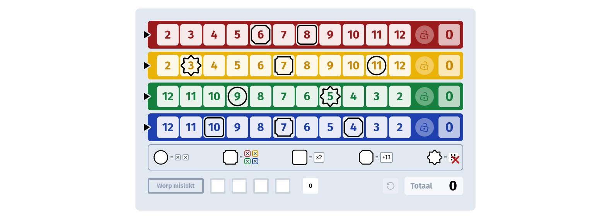

# Qwixx


This is a [Next.js](https://nextjs.org/) project bootstrapped with [`create-next-app`](https://github.com/vercel/next.js/tree/canary/packages/create-next-app).



## Demo version

[View on vercel](https://qwixx-eight.vercel.app/)

## Getting Started

First, run the development server:

```bash
yarn dev
```

Open [http://localhost:3000](http://localhost:3000) with your browser to see the result.

## Run tests

This project leverages Playwright to run the tests

```bash
yarn e2e
```